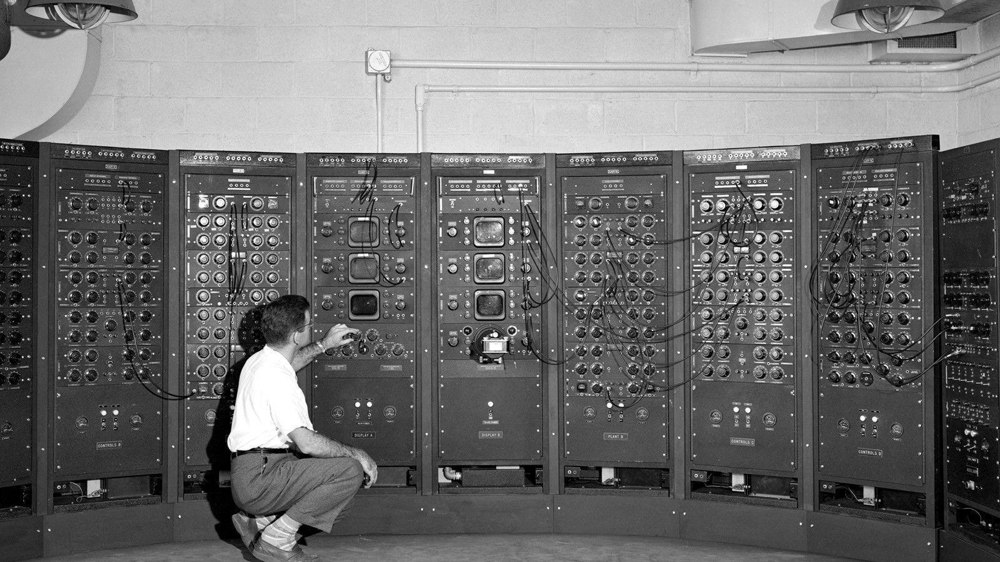

# Computer Architecture and Logic
I’m always curious about how things work and seeing the history of computers really interested me. The oversized computers with huge power transformers and vacuum tubes was quite a site to see.

Types of input devices also caught my attention. Especially touch sensitive devices and user interfaces. The evolution of input devices is quite amazing.

The video on binary numbers and how computers interpret them was new to me. How numbers can represent sound, images, and text is remarkable.

[<== Back to Table of Contents](README.md)